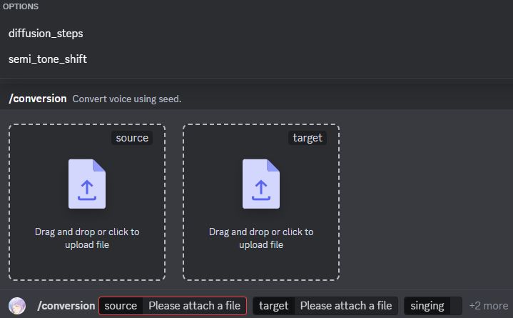

# ✨ Usada-VC 🎤

[English](README.md)

* このUsada-VCは、Discordをseedのインターフェースとして使用するためのアプリケーションです。
> ゼロショット音声変換🔊とゼロショット歌声変換🎙をサポートしています。
> トレーニングなしで、1〜30秒の参照音声から声をクローンすることができます。

## 🚀 使い方

1. 音声変換したい音声ファイル（変換元）と、変換先の音声ファイルを用意します。
2. `/conversion` コマンドを実行し、以下のオプションを指定します。

    * **source:** 変換元の音声ファイル (必須)
    * **target:** 変換先の音声ファイル (必須)
    * **singing:** 歌声モードを有効にするかどうか (必須, true/false)
    * **diffusion_steps:** 拡散ステップ数 (1-100, オプション)
    * **semi_tone_shift:** 半音シフト (歌声モードのみ, オプション)



3. Usada-VCが音声を変換し、結果を返信します。

## 🛠️ インストール方法

1. このリポジトリをクローンします。
2. npmパッケージをインストールします。
   ```bash
   npm install
      ```
3. `conversion` ディレクトリにある `seed_setup.bat` を実行して必要な環境を構築します。
4.  `conversion\seed`のvenv環境に必要なライブラリをインストールします。
   ```bash
   cd conversion\seed
   python -m venv env
   .\env\Scripts\activate
   pip install -r requirements.txt
   ```
4. `index.js`と同じディレクトリに`.env` ファイルを作成し、`TOKEN` にDiscord Botのトークンを設定します。
5. Botの初回起動時には、deploy_and_start.batを実行します。
   もしくは `index.js` を `--deploy` 引数付きで実行してコマンドをDiscordへデプロイします。
   ```bash
   node index.js --deploy
   ```
5. (初回のみ音声変換開始前にモデルのダウンロードが自動で実行されます。すこし時間がかかります。)

## 💻 環境

* Windows環境での実行のみを想定しています。
* python 3.10の環境が期待されています。
* Node.js 20.17を使用して構築しました。

## 📝 注意点

* 音声ファイルはWAV形式に対応しています。
* 半音シフトは歌声モードでのみ使用できます。
* 変換処理には時間がかかる場合があります。
* 自己責任で使用してください。実行した時点で自己責任での実行に同意したとみなします。
* このリポジトリが将来的にメンテナンスされるかどうかは保証できません。(既に新たなインスピレーションに取り組んでいます)

## 🤝 謝辞

このUsada-VCのseedは、Plachtaaさんのリポジトリからフォークしています。多大な敬意と感謝を示します✨

---